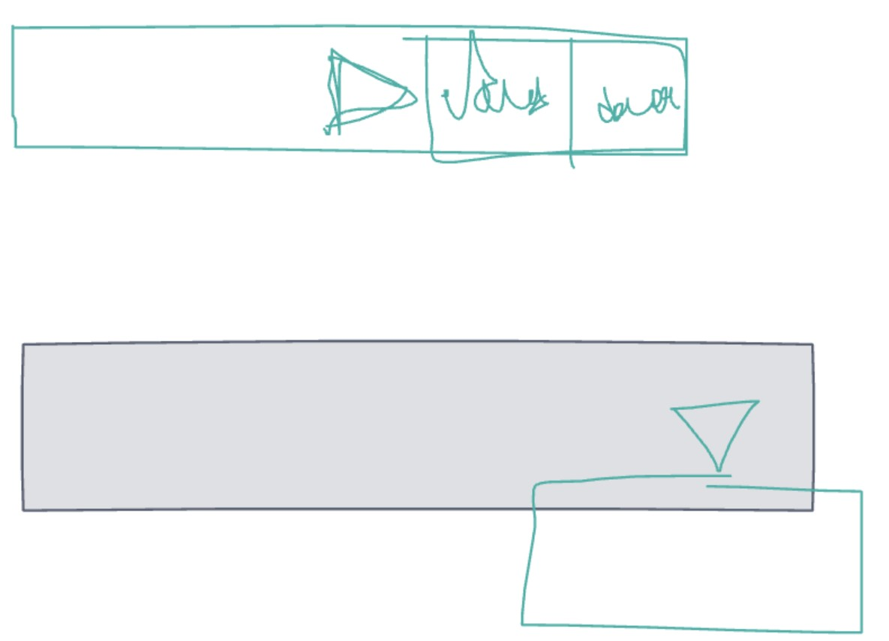

# CS 124 Lab 1
Devika Mehr and William La
CS124 Section 1
index: 
Sept. 23 2021

Design Decisions and Rationale
------------------------------
Our biggest design choice was to ensure our header remained the same on each screen. We agreed on this as we believed this would give a cohesive look and not add “too much” to the changing screens. 
Similarly, we wanted to ensure our black button on the bottom remained in the same position in every screen. But, the icon would change from a plus button to a delete button for different tasks. This would ensure familiarity of where the action button would be, but would also visually change for each command. 
We also ensured we had the same color scheme for every task and just lightened the task boxes from the background to make sure the overall look was light and easy on the eyes to read. 
Also, for our Filter feature, we wanted to ensure the user knew which “screen” they were on, so we decided to bolden the text to visually alert the user they were looking at either the “completed” or “uncompleted” screen.
Finally, we ensured we had down arrows for any dropdown menu and a tappable filter button as well. We wanted a few interactive features to minimize how complicated the application could get, but also provide more functionality. 

Alternative Designs Considered
------------------------------
For the dropdown menu functionality where we can choose to edit or delete an individual item, we initially had two designs. 
The first design had the dropdown icon rotate and shift to the left while the two menu options appear next to it after the icon was clicked.
The second design features a menu that drops down after the icon was clicked featuring the two menu options. We ultimately decided to go with this second design as it was simpler and more accurately displayed the functionality expected from a dropdown icon.

User Testing
------------
For user testing, we conducted two tests with two different users. One user was an avid to-do list user while another user didn’t use them quite often. While they went through the screens, they enjoyed the colors and were able to speak out about their actions easily. One point the avid to-do list user mentioned was our broken heart emoji on the “empty tasks” screen sparked a bit of anxiety that she had no tasks to complete and it confused her on why it was sad. While going through the dropdown boxes, one user was confused at first with the “Edit” and “Delete” options but once they saw the next screen they realized that you could edit and delete the tasks. Overall, both of them enjoyed the colors and felt it was simple enough to use, and were eager to see how we’d improve it. 

Final Design
------------

Challenges
----------
While creating our tasks, we faced a few challenges towards the end of each task. When we would add on a new feature or edit the way our task looked like, we would often forget to add the new ids and classes to our original starter and middle files. This would often be caught towards the end of the process, when we had completely forgotten what we had edited. While we were able to fix this with inspect element, it was still a challenge to figure out what had to be edited and fixed to re-adjust and create a more cohesive look. 

Parts of the Design We're Most Proud of
---------------------------------------
We’re most proud of our color choice and mainly being able to implement every idea we had. When we first started, we didn’t know if we would be able to implement each and every item and figured that we could adapt our design to something simpler. But, as we were able to use the skills learned from class, we were able to mainly attempt every idea we had. One thing we’re most proud of is using Google’s icons and incorporating that into our look.