# CS 124 Lab 2
Devika Mehr and William La

CS124 Section 1

[Link to deployed app](https://william-la.github.io/cs124/)

Oct. 14th 2021

Design Decisions, Rationale, and Alternative Designs Considered
------------------------------
For this lab, we decided to follow through with most of the design choices we made in lab 1. This is because we enjoyed our design and also believed it would be good practice to learn how to link everything with React. It was also convenient to pull from our existing CSS file. 

A design decision that differed from our first lab was the flow of our task filter action. We previously had a filter icon that displayed a menu when it was clicked. The menu would stay on the screen to display the state of the filter.

#### Old Filter
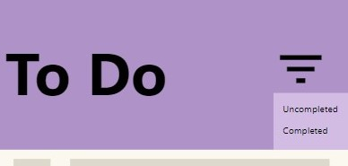

One of our user testers mentioned that it was hard to understand what the icon was and, after a bit of deliberation, we agreed that our lab 1 approach was clunky and unintuitive. Instead, we decided on a simple dropdown menu. We believe that a dropdown menu is a great approach because it is intuitive and displays the state of the filter without taking up additional space. 

#### New Filter

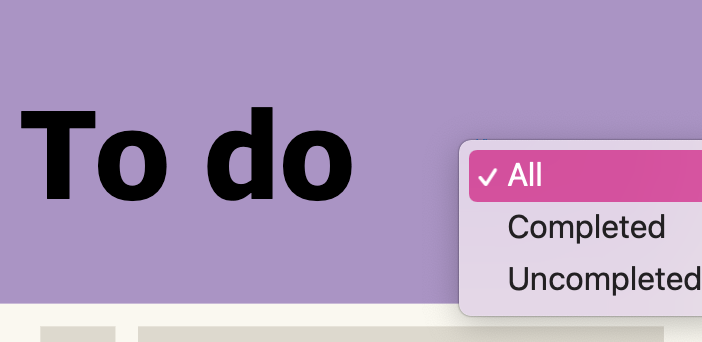
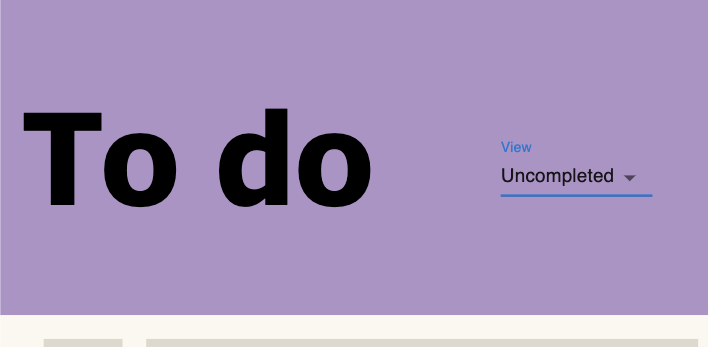

Another design decision we made was in the flow of creating a new task. Our previous approach took our users to a new task creation page whenever they pressed the plus button in the bottom right of the screen. 

#### Old Task Creation

Rather than take our user to a new screen, we decided to prompt our users with a modal when they want to create a new task. We felt that this modal approach gave our users a more seamless experience for task creation. We also extended this modal functionality to our edit tasks, which also used to take users to a new screen. 

#### New Task Creation
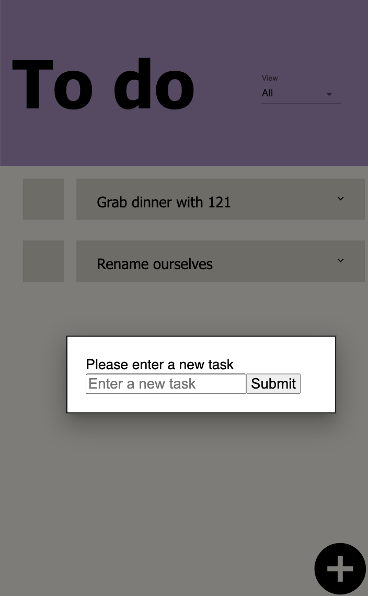

#### Edit Task Modal
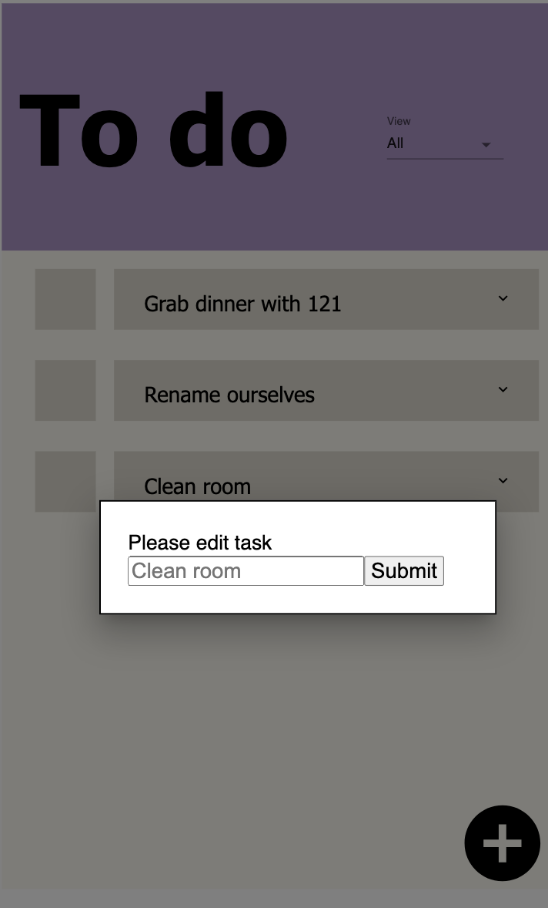

### Design Decisions and Rationale From Lab 1

We wanted to ensure our black button on the bottom remained in the same position in every screen. But, the icon would change from a plus button to a delete button for different tasks. This would ensure familiarity of where the action button would be, but would also visually change for each command. 
We also ensured we had the same color scheme for every task and just lightened the task boxes from the background to make sure the overall look was light and easy on the eyes to read. 
We wanted a few interactive features to minimize how complicated the application could get, but also provide more functionality. 

### Alternative Designs From Lab 1

For the dropdown menu functionality where we can choose to edit or delete an individual item, we initially had two designs. 
The first design had the dropdown icon rotate and shift to the left while the two menu options appear next to it after the icon was clicked.
The second design features a menu that drops down after the icon was clicked featuring the two menu options. We ultimately decided to go with this second design as it was simpler and more accurately displayed the functionality expected from a dropdown icon.

#### Dropdown alternative design
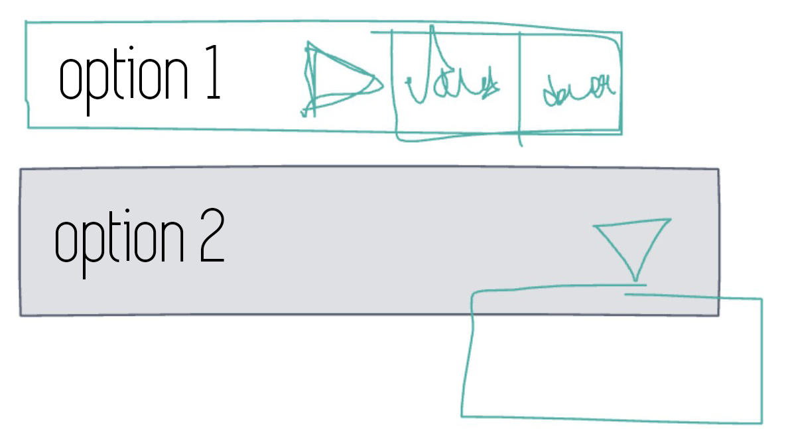

We also considered adding a "select all" box similar to the one commonly used in mail applications like Gmail. 

#### Select All Box Gmail Example
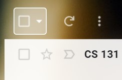

We initially thought that this select all feature could help users select a screen of tasks (i.e. all completed tasks) and easily delete them. However, we then thought about the 80-20 rule and determined that this feature may detract from the simplicity of our app. The conclusion we reached was that users would likely only delete all of the tasks on their screen when they were looking at all of the completed tasks. Otherwise, users would likely delete individual tasks using the dropdown menu for each task. So, we decided against adding this select all box and instead modified our button in the lower right of the screen to be a delete all button only when users show all completed tasks.

#### Select All Box Concept Design
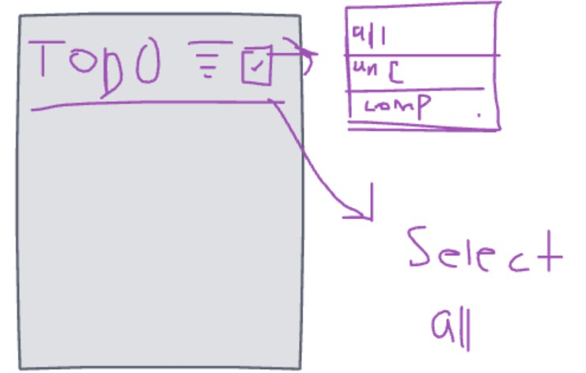

User Testing
------------
We had one user go through the application and she gave great feedback on two key parts. She mentioned that removing the positive empty list text was a good idea as it can create feelings to “rush” through tasks to receive a message. When we told her that we used to have a message that said “Oh no! No more tasks to do” she mentioned that any text could make a user more anxious about their productivity. Therefore, we decided to remove the text altogether.

#### Old Empty Screen
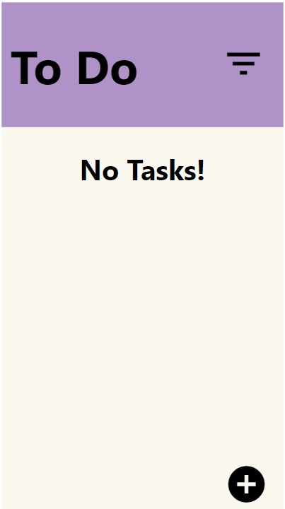

#### New Empty Screen
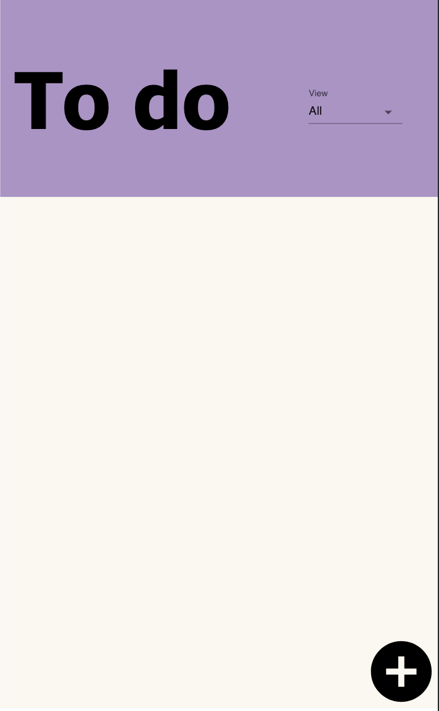

Then, she mentioned that the filter icon was a bit confusing and did not look like something she would obviously tap at first glance. When I mentioned we were thinking about using a dropdown menu, she agreed that a dropdown menu is more obvious to a user as they intuitively know that there are options hidden below. 

Another user who went through our todo list spotted an error within our implementation of our task dropdown icons. We intially had the position of the dropdown icons set to 'fixed'; however, this led to unexpected behavior when users scrolled through our app. The dropdown icon would be fixed on the user's screen, which made it stay on screen while its associated task scrolled off.

#### Broken Dropdown
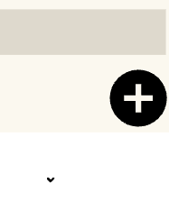

We're thankful that our user pointed out this bug and were able to make the appropriate fixes to the CSS.

Final Design
------------
### Task 1 - In an empty list, create an item named "Buy new John Grisham book"
Users are presented with an empty list and are able to press the plus button in the lower right of the screen to begin creating a new todo task. When users press the button, a task creation modal appears where they can enter a task title and submit their task by pressing the submit button. Once they submit their task, it is viewable on the main todo page.

Start

Middle - After the plus button is pressed

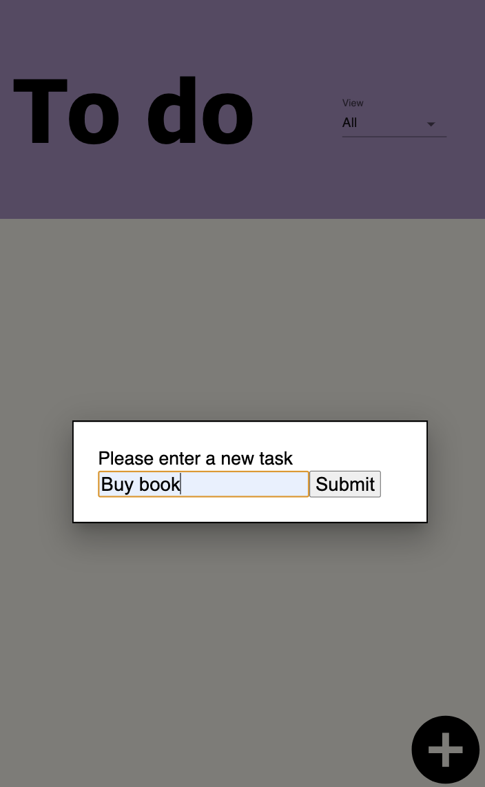

End - After the submit button is pressed

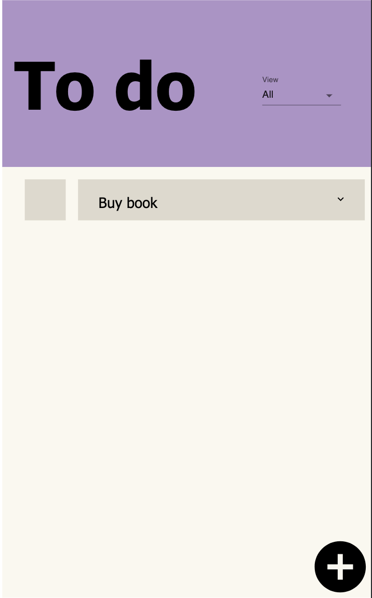

### Task 2 - In a non-empty list, create an item named "Eat Lunch"
Task 2 is very similar to task 1; however, users start with a non-empty list. Users can press the plus button to create and submit a task. This task appears under the task that was previously there. 

Start

Middle - After the plus button is pressed

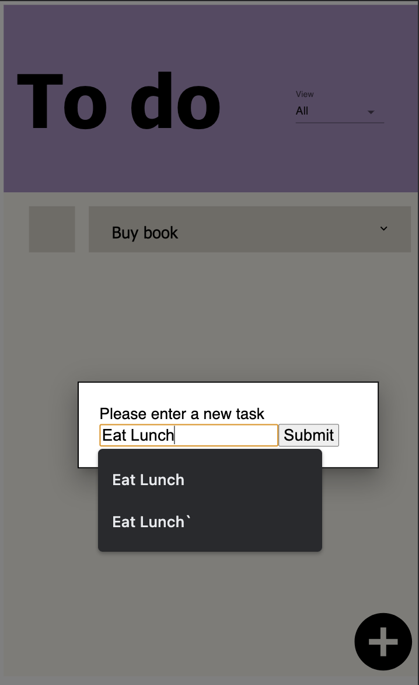

End - After the submit button is pressed

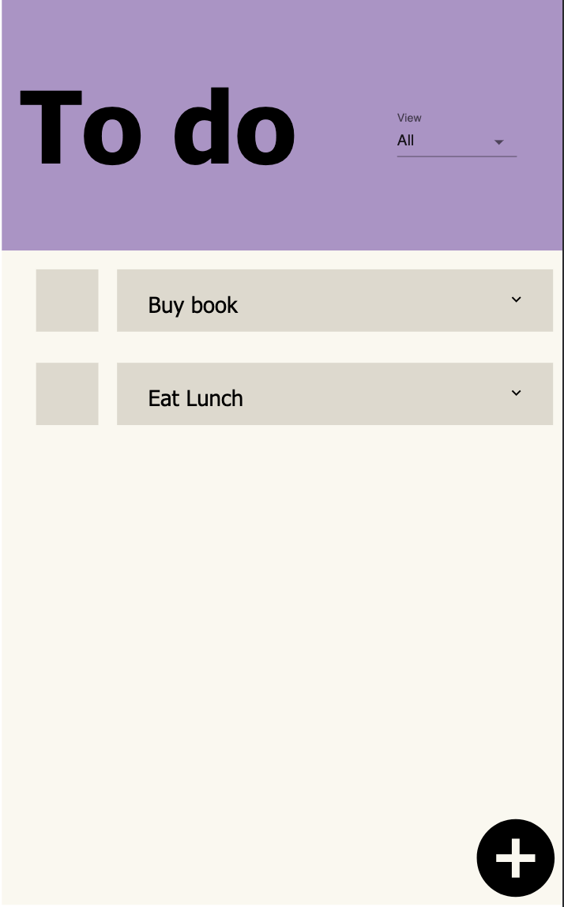

### Task 3 - Mark the item named "Call Mom" completed
Users start with a list of tasks including the "Call Mom" task. They are able to click the empty checkbox next to the task title to complete the task, which visually strikes through the title and adds a check to the checkbox. 

Start

End - After the "Call Mom" checkbox is pressed

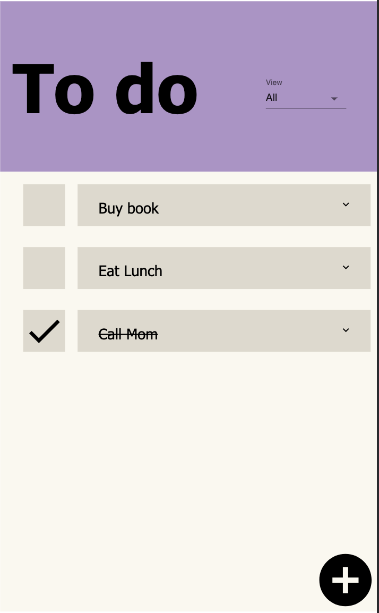

### Task 4 - Rename the item "Text John" to "Text John about bank statements"
Starting with a list including the "Text John" task, users can press the dropdown arrow icon to the right of the task title. Pressing this opens up a menu with two options: "Edit" and "Delete". When users press the "Edit" option, a modal appears where they can enter an updated task title in the text field. Once they edit the task title, they can press the submit button and the item will be updated on the main todo screen. 

Start

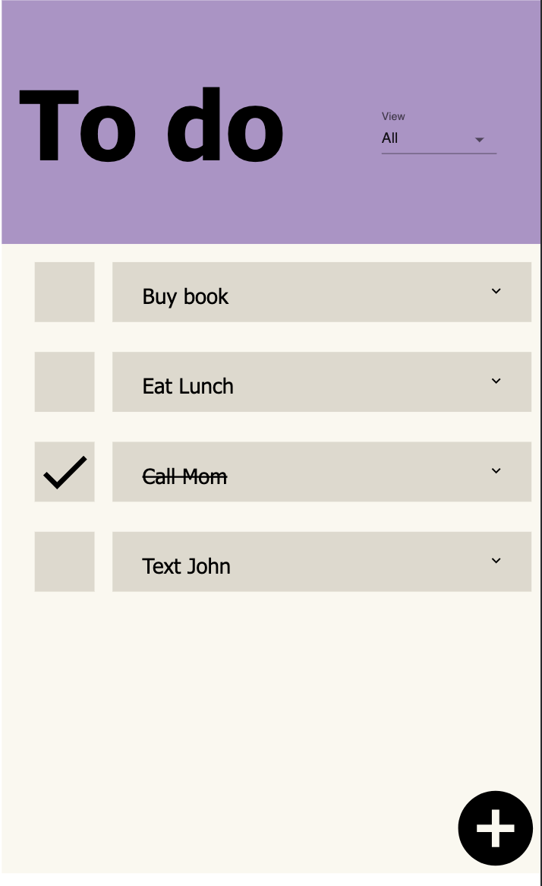

Middle 1 - After the dropdown icon is pressed

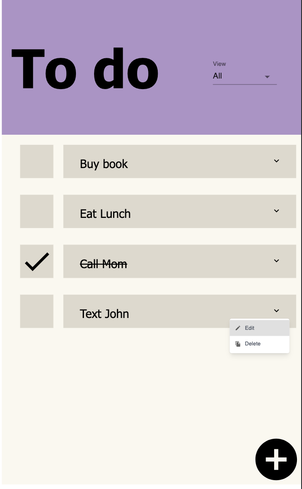

Middle 2 - After the edit item option is pressed

End - After the submit button is pressed

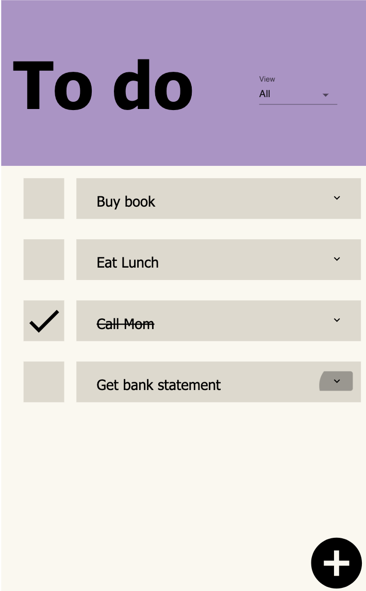

### Task 5 - Show only uncompleted items
Starting with the todo main page, users can press on the "View" bar on the top right of the screen to open up a filter dropdown menu. This menu has "All", "Uncompleted", and "Completed" as options. Pressing "Uncompleted" updates the main todo page to not include the completed tasks. The "Uncompleted" option becomes the value of the "View" bar to remind the user that they are looking at that subset of tasks.

Start

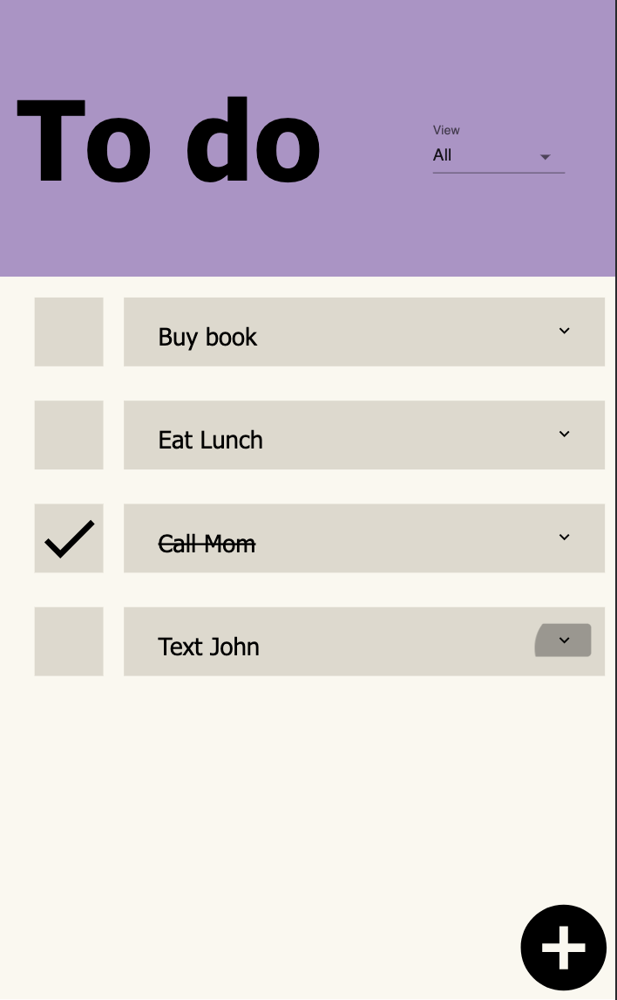

Middle - After the "View" bar is pressed

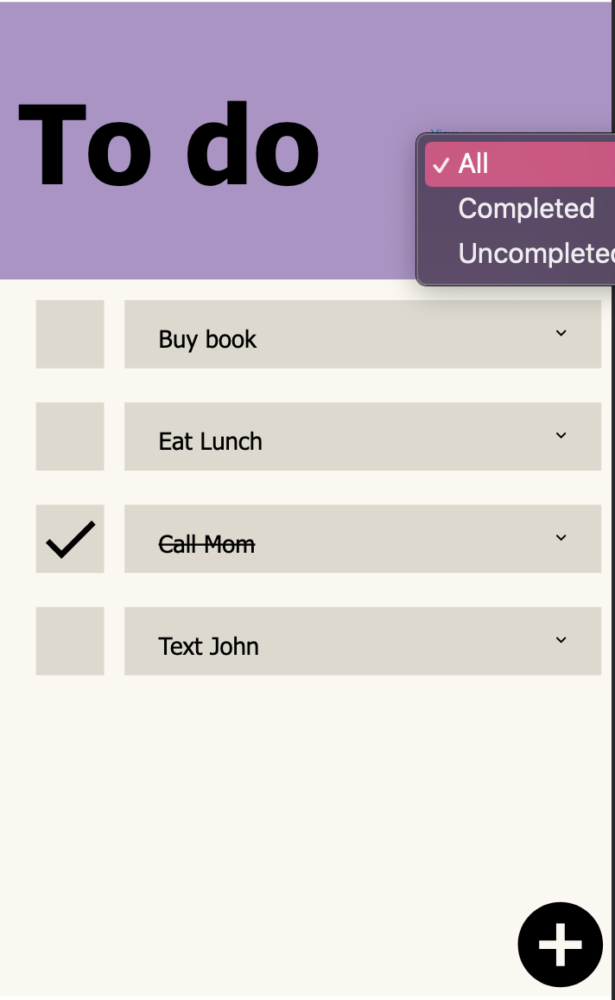

End - After the "Uncompleted" option is pressed

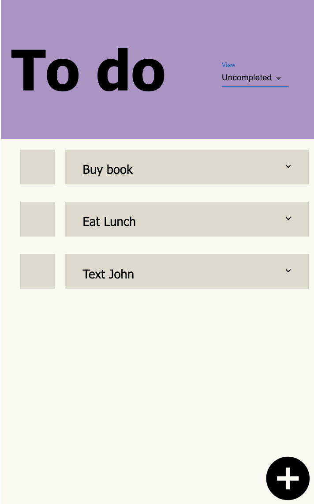

### Task 6 - Delete all completed items
Similar to task 5, users can press the "View" bar to open up the filter dropdown menu. Pressing "Completed" hides all of the uncompleted tasks as well as changes the functionality of the button on the lower right (Note: this means users can not create tasks while only showing completed tasks, which we determined as okay due to the 80/20 rule). The button becomes a delete all button which deletes all of the tasks on screen. The "Completed" option becomes the value of the "View" bar to remind the user that they are looking at a subset of tasks. Once users press the delete all button, the completed tasks on screen are removed.

Start

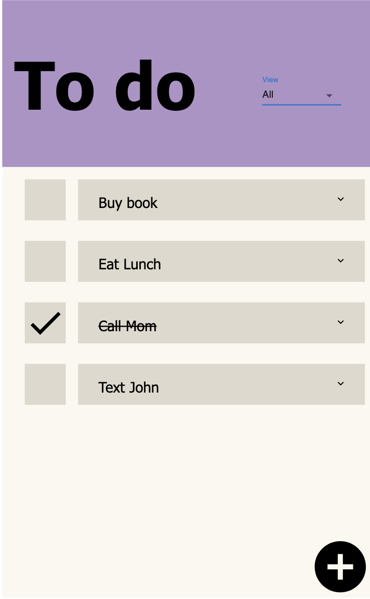

Middle 1 - After the "Completed" view is selected

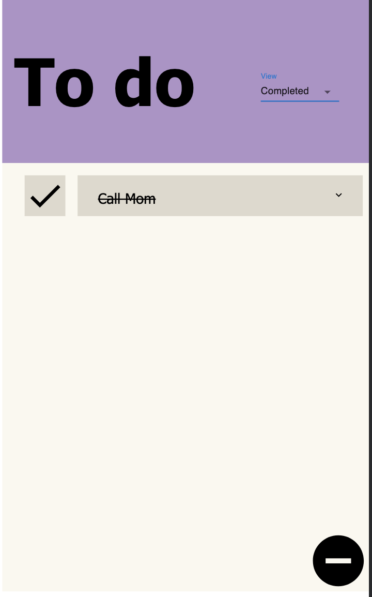

End - After the delete all button is pressed

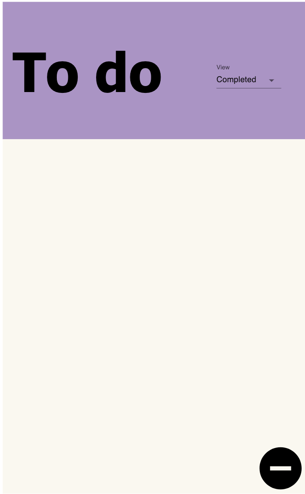

Challenges
----------
One challenge we faced was definitely debugging react. While in other languages you can get exact error messages with syntactical rules, in React, sometimes the error messages are so unique to your project that the internet has no help. But, this required us to be resourceful with debugging and also trying to step through our code logically. 

Another challenge we faced was figuring out the MaterialUI CSS versus our CSS as well. We picked a library that one of the partners felt extremely confident in using as they have had lots of experience with the library before. But, when we imported most of the modules into our project, we realized that the way MaterialUI styles their components were different from the .css files in our project. We were able to resolve this issue by using google inspect element, in-line styles, and learning more about useStyles() and JSS in React. While sometimes it was extremely easy to figure out which MaterialUI class we had to manipulate, sometimes it could be incredibly frustrating indexing through different classes and trying to manipulate the component. But, as time went on, we were able to find a pattern and design our app just the way we liked. 

Parts of the Design We're Most Proud of
---------------------------------------
One task that seemed incredibly daunting was our “filter” task which had to check the status of a task and only display the user-selected filter on the screen. At first, we suspected that this would take quite a large portion of our time together so we decided to leave it off till the end. But, after reading up on useEffect() and looking into the switch keyword, we realized that we could definitely understand how to implement this and how to connect the pieces together. When we were able to get our filter to work, we felt incredibly proud and also more confident in our debugging skills too. We're also very proud of the design decisions we made when implementing this filter option, as we believe the "View" bar and dropdown menu are very user friendly approaches to filtering. 

Finally, we’re extremely proud of everything we made! It seemed daunting at first to make a WHOLE application in React, but, after many hours of debugging, celebration, and google searching we are so proud of it and think it can definitely evolve to something even better too! 
