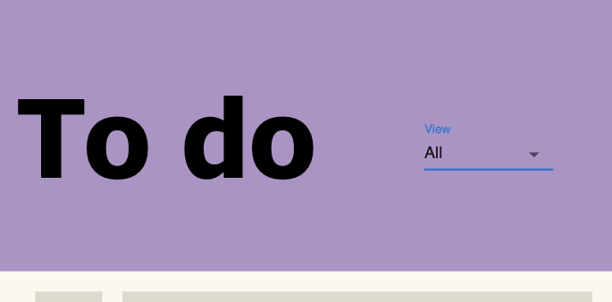
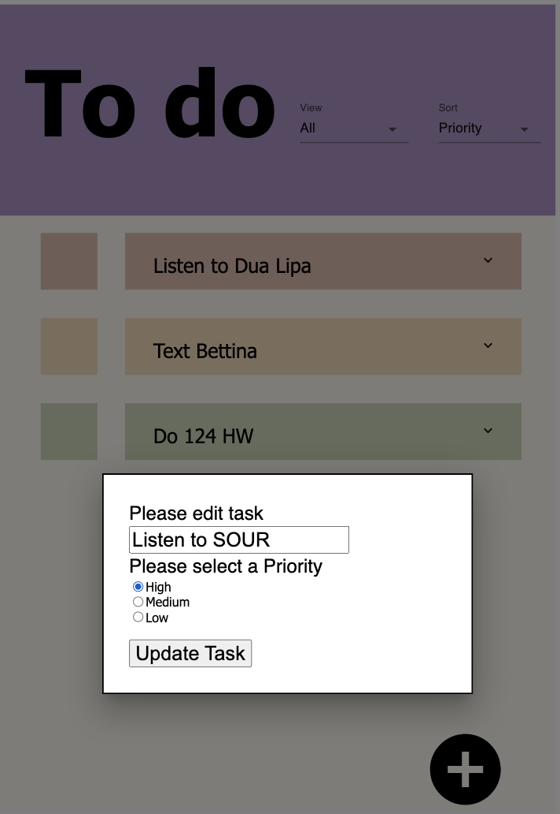

# CS 124 Lab 3
Devika Mehr and William La

CS124 Section 1

[Link to deployed app](https://william-la.github.io/cs124/)

Nov. 4th 2021

Design Decisions, Rationale, and Alternative Designs Considered
------------------------------
For this lab, we added two new additions to our UI. First, we added a new dropdown menu that allows a user to select sorting by Date, Name, and Priority. We decided that ascending Date and Name in addition to descending Priority was the most intuitive display of the different sorting options.

#### Sorting

#### Sorting Dropdown

We decided to add a new dropdown as we already had our filtering function use a dropdown as well. Upon further discussion, we agreed that if users already knew that a dropdown could change the “view” of our ToDo app, then, therefore, we should also use a dropdown to help sort our tasks too. Using a second dropdown also allowed us to refactor our Dropdown.Js file and add props to help with the usability and scalability of the file as well!

We also included radio buttons in our Modal to allow users to create tasks with priority. 

#### New Task Priority

By default, each task is given “medium” priority. It is up to the user to decide if a task should be “High” or “Low’. If they would like to change the priority, they can do so when they edit the task itself.

#### Edit Task Priority

We decided to go with radio buttons so that the user could see all options when they first glance at the modal. We also thought the buttons were concise and also force the user to only pick one option instantly. We also colored the background of the task and checkbox based on the priority of the task itself.

#### Priority Colors

For high priority tasks, we gave it a pastel red while lower priority tasks got a pastel green. We agreed that “medium” tasks could get a pastel orange to balance between the red and green. 

In terms of the other design aspects of this lab, we decided to stay true to most of the design choices we made in labs 1 and 2. This is because we enjoyed our design and also believed it would be good practice to learn how to link everything with React. It was also convenient to pull from our existing CSS file. 

### Relevant Design Decisions, Alternative Designs, and Rationale From Lab 2
A design decision that we made in previous labs was the flow of our task filter action. We previously had a filter icon that displayed a menu when it was clicked. The menu would stay on the screen to display the state of the filter.

#### Old Filter

One of our user testers mentioned that it was hard to understand what the icon was and, after a bit of deliberation, we agreed that our lab 1 approach was clunky and unintuitive. Instead, we decided on a simple dropdown menu. We believe that a dropdown menu is a great approach because it is intuitive and displays the state of the filter without taking up additional space. 

#### New Filter

Another design decision we made was in the flow of creating a new task. Our previous approach took our users to a new task creation page whenever they pressed the plus button in the bottom right of the screen. 

#### Old Task Creation

Rather than take our user to a new screen, we decided to prompt our users with a modal when they want to create a new task. We felt that this modal approach gave our users a more seamless experience for task creation. We also extended this modal functionality to our edit tasks, which also used to take users to a new screen. 

#### New Task Creation

#### Edit Task Modal

### Relevant Design Decisions, Alternative Designs, and Rationale From Lab 1

We wanted to ensure our black button on the bottom remained in the same position in every screen. But, the icon would change from a plus button to a delete button for different tasks. This would ensure familiarity of where the action button would be, but would also visually change for each command. 
We also ensured we had the same color scheme for every task and just lightened the task boxes from the background to make sure the overall look was light and easy on the eyes to read. 
We wanted a few interactive features to minimize how complicated the application could get, but also provide more functionality. 

For the dropdown menu functionality where we can choose to edit or delete an individual item, we initially had two designs. 
The first design had the dropdown icon rotate and shift to the left while the two menu options appear next to it after the icon was clicked.
The second design features a menu that drops down after the icon was clicked featuring the two menu options. We ultimately decided to go with this second design as it was simpler and more accurately displayed the functionality expected from a dropdown icon.

### Alternative Designs
#### Priority Colors
We did consider not coloring our prioritized tasks as we felt like it might cause user anxiety. But, after talking to someone who studies Psychology, we were assured that the colors actually help visually stimulate our application. She suggested we used the traditional “Red, Orange, Green” visual to display the different priorities. When we added this, we felt like the colors were too harsh and did not go along with our CSS. Therefore, we decided to meet her halfway and add “softer” colors that aligned more with our original style.

We also decided to color the checkbox the same color as the task itself so it would be easier to keep track of which checkbox belonged to which task.
#### Old Colors

#### New Colors

#### Dropdown alternative design

We also considered adding a "select all" box similar to the one commonly used in mail applications like Gmail. 

#### Select All Box Gmail Example

We initially thought that this select all feature could help users select a screen of tasks (i.e. all completed tasks) and easily delete them. However, we then thought about the 80-20 rule and determined that this feature may detract from the simplicity of our app. The conclusion we reached was that users would likely only delete all of the tasks on their screen when they were looking at all of the completed tasks. Otherwise, users would likely delete individual tasks using the dropdown menu for each task. So, we decided against adding this select all box and instead modified our button in the lower right of the screen to be a delete all button only when users show all completed tasks.

#### Select All Box Concept Design

User Testing
------------
As mentioned in previous paragraphs, we did ask someone who has had experience with Psychology to look over our application and she gave us great feedback regarding the priority colors. It was great hearing her thoughts on our application and she didn’t have much more feedback other than the fact that she enjoyed that we continued to use dropdowns and that she felt like the application was a bit slow to update. We couldn’t really fix the “quickness” of the database due to outside constraints, but she at least appreciated seeing the “Loading” screen when things were refreshing. 

### User Testing From Previous Labs
We had one user go through the application and she gave great feedback on two key parts. She mentioned that removing the positive empty list text was a good idea as it can create feelings to “rush” through tasks to receive a message. When we told her that we used to have a message that said “Oh no! No more tasks to do” she mentioned that any text could make a user more anxious about their productivity. Therefore, we decided to remove the text altogether.

#### Old Empty Screen

#### New Empty Screen

Then, she mentioned that the filter icon was a bit confusing and did not look like something she would obviously tap at first glance. When I mentioned we were thinking about using a dropdown menu, she agreed that a dropdown menu is more obvious to a user as they intuitively know that there are options hidden below. 

Another user who went through our todo list spotted an error within our implementation of our task dropdown icons. We intially had the position of the dropdown icons set to 'fixed'; however, this led to unexpected behavior when users scrolled through our app. The dropdown icon would be fixed on the user's screen, which made it stay on screen while its associated task scrolled off.

#### Broken Dropdown

We're thankful that our user pointed out this bug and were able to make the appropriate fixes to the CSS.

Final Design
------------
### Task 1 - In an empty list, create an item.
Users are presented with an empty list and are able to press the plus button in the lower right of the screen to begin creating a new todo task. When users press the button, a task creation modal appears where they can enter a task title and priority level. They submit their task by pressing the "Create Task" button. Once they submit their task, it is viewable on the main todo page and is colored according to the priority level.

Start

Middle - After the plus button is pressed and fields are filled out

End - After the submit button is pressed

### Task 2 - In a non-empty list, create an item.
Task 2 is very similar to task 1; however, users start with a non-empty list. Users can press the plus button to create and submit a task. This task appears according to the current sorting method, which is by default the date created. The app shows the longest outstanding tasks at the top when sorting by date, so a newly created task appears at the bottom of the list. 

Start

Middle - After the plus button is pressed

Middle pt 2 - Filling out fields

End - After the submit button is pressed

### Task 3 - Mark an item completed
Users start with a list of tasks including the "Listen to Dua Lipa" task. They are able to click the empty checkbox next to the task title to complete the task, which visually strikes through the title and adds a check to the checkbox. 

Start

End - After the "Listen to Dua Lipa" checkbox is pressed

### Task 4 - Rename an item and edit priority level
Starting with a non-empty list, users can press the dropdown arrow icon to the right of the task title. Pressing this opens up a menu with two options: "Edit" and "Delete". When users press the "Edit" option, a modal appears where they can edit the task title in the text field as well as change the priority level of the task. Once they make their edits, they can press the submit button and the item will be updated on the main todo screen. 

Start - Pressing the dropdown icon

Middle 1 - After the edit item option is pressed

Middle 2 - After updating "Do 124 HW" to "Listen to SOUR" and changing the priority level

End - After the submit button is pressed

### Task 5 - Show only uncompleted items
Starting with the todo main page, users can press on the "View" bar on the top portion of the screen to open up a filter dropdown menu. This menu has "All", "Uncompleted", and "Completed" as options. Pressing "Uncompleted" updates the main todo page to not include the completed tasks. The "Uncompleted" option becomes the value of the "View" bar to remind the user that they are looking at that subset of tasks.

Start

Middle - After the "View" bar is pressed

End - After the "Uncompleted" option is pressed

### Task 6 - Delete all completed items
Similar to task 5, users can press the "View" bar to open up the filter dropdown menu. Pressing "Completed" hides all of the uncompleted tasks as well as changes the functionality of the button on the lower right (Note: this means users can not create tasks while only showing completed tasks, which we determined as okay due to the 80/20 rule). The button becomes a delete all button which deletes all of the tasks on screen. The "Completed" option becomes the value of the "View" bar to remind the user that they are looking at a subset of tasks. Once users press the delete all button, the completed tasks on screen are removed.

Start

Middle 1 - After the "Completed" view is selected

End - After the delete all button is pressed

### Additional Sorting
Here are examples of using the sorting feature of our app. Users can sort tasks similar to how they can change the view of which kind of tasks appear by interacting with the dropdown at the top right of the screen. Tasks can be sorted by Date, Name, and Priority.

Sorting by Date Created. Tasks appear from oldest (top) to newest (bottom)

Sorting by Task Name. Tasks appear alphabetically from the top down.

Sorting by Task Priority. Higher priority tasks appear first.

Challenges
----------
We struggled a lot with filtering our tasks with the addition to the database. Originally, we used a “useEffect” to help filter our todos and update our view when doing so. But, with Firebase, this would cause our application to re-render too many times and crash. We spent a lot of time trying to debug and trying different methods of filtering until we combined our previous method with the database and used a map function to transpose the data onto the view. While the code might seem simple, this took us quite a while to fix and once it finally worked, we were quite happy!

### Challenges from previous labs
One challenge we faced was definitely debugging react. While in other languages you can get exact error messages with syntactical rules, in React, sometimes the error messages are so unique to your project that the internet has no help. But, this required us to be resourceful with debugging and also trying to step through our code logically. 

Another challenge we faced was figuring out the MaterialUI CSS versus our CSS as well. We picked a library that one of the partners felt extremely confident in using as they have had lots of experience with the library before. But, when we imported most of the modules into our project, we realized that the way MaterialUI styles their components were different from the .css files in our project. We were able to resolve this issue by using google inspect element, in-line styles, and learning more about useStyles() and JSS in React. While sometimes it was extremely easy to figure out which MaterialUI class we had to manipulate, sometimes it could be incredibly frustrating indexing through different classes and trying to manipulate the component. But, as time went on, we were able to find a pattern and design our app just the way we liked. 

Parts of the Design We're Most Proud of
---------------------------------------
We really are proud of the new sorting system we put in place as it seemed quite challenging at first. Thankfully, the videos from the Firebase days did help us sort our data, but seeing it work in real-time with our functioning tasks was a great feeling!
We’re also incredibly proud of the new colors we added to our application as we feel like it fits our “aesthetic” and that we were able to finally fix our filtering issue before the due date too :) 

### Proud designs from previous labs
One task that seemed incredibly daunting was our “filter” task which had to check the status of a task and only display the user-selected filter on the screen. At first, we suspected that this would take quite a large portion of our time together so we decided to leave it off till the end. When we were able to get our filter to work, we felt incredibly proud and also more confident in our debugging skills. We're also very proud of the design decisions we made when implementing this filter option, as we believe the "View" bar and dropdown menu are very user friendly approaches to filtering. 

Finally, we’re extremely proud of everything we made! It seemed daunting at first to make a WHOLE application in React, but, after many hours of debugging, celebration, and google searching we are so proud of it and think it can definitely evolve to something even better too! 
